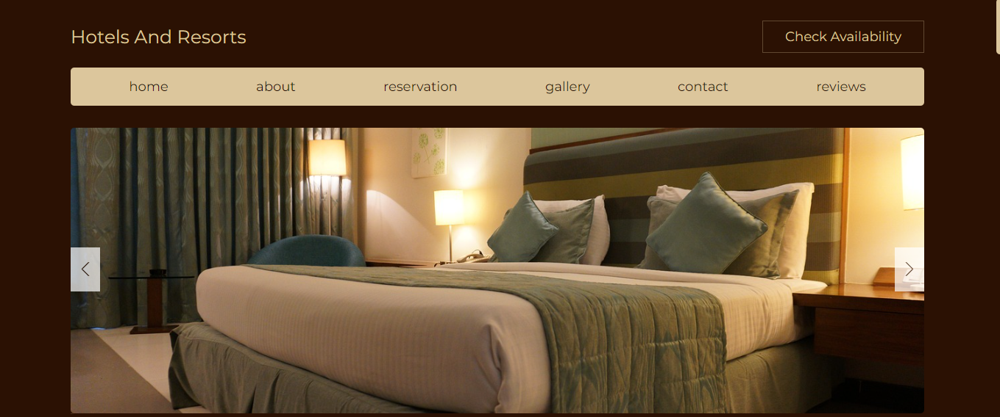

# Hotel Rezervasyon Web Sitesi

Bu proje, kullanıcıların otel rezervasyonlarını yapabilecekleri bir web sitesi tasarlamayı amaçlayan bir örnek proje içermektedir. Web sitesi, müşterilere otel seçenekleri sunar ve rezervasyon işlemlerini kolaylaştırır.

## Özellikler

- **Otel Kataloğu:** Web sitesi, farklı otellerin listesini sunan bir katalog sayfasına sahiptir. Her otel için resimler, açıklamalar, fiyatlar ve diğer detaylar gösterilir.
- **Rezervasyon İşlemi:** Kullanıcılar, istedikleri oteli seçip rezervasyonlarını yapabilirler. Tarih seçimi, oda tipi ve diğer tercihler gibi bilgiler girilerek rezervasyon işlemi tamamlanır.
- **Kullanıcı Profili:** Müşteriler, kendi hesaplarını oluşturabilir ve rezervasyon geçmişlerini görüntüleyebilirler.
- **Ödeme İşlemi:** Web sitesi, güvenli bir ödeme işlemi sunar. Kullanıcılar, rezervasyonlarını ödemek için farklı ödeme yöntemlerini kullanabilirler.
- **Responsive Tasarım:** Web sitesi, farklı cihazlarda ve ekran boyutlarında mükemmel bir görüntüleme sağlamak için tamamen responsive bir tasarıma sahiptir.
- **Geçiş Efektleri:** Sayfa geçişleri ve animasyonlar ile etkileyici bir kullanıcı deneyimi sunar.

## Kurulum

1. Projeyi indirin veya kopyalayın.
2. Proje dosyalarını bir metin düzenleyicisiyle açın.
3. `index.html` dosyasını web tarayıcınızda açarak hotel rezervasyon web sitesini görüntüleyebilirsiniz.

## Ekran Görüntüsü

